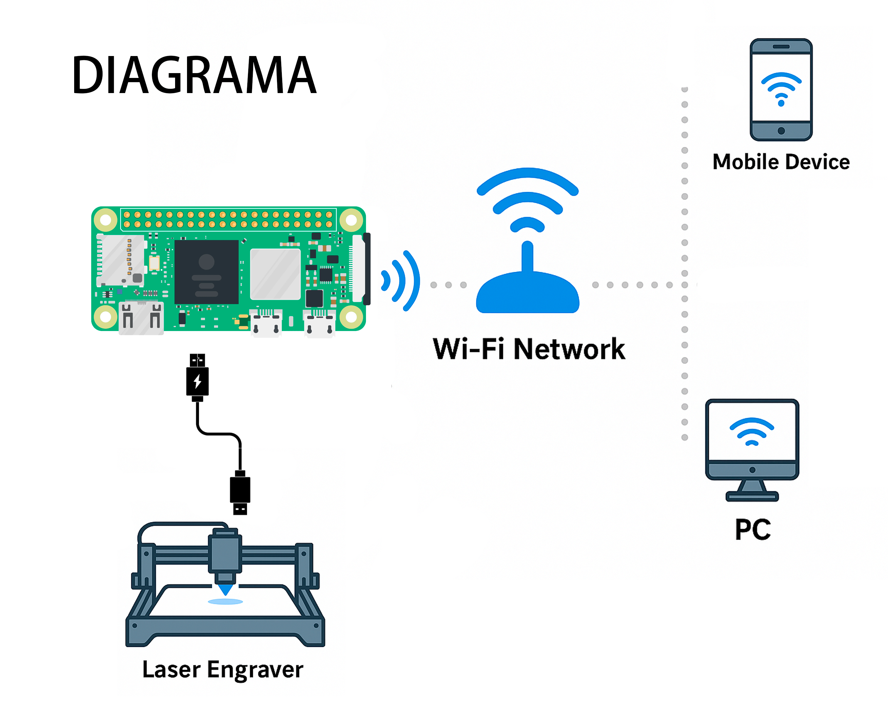

# WiFi GRBLink - Conecta tu Máquina Láser GRBL a Wi-Fi

🚀 Proyecto desarrollado para convertir una Raspberry Pi o similar en un puente inalámbrico Wi-Fi, permitiendo controlar máquinas que usan el protocolo GRBL de forma remota a través de IP.

---

## 📸 Vista de la Interfaz


## 📸 Diagrama



## 📦 Contenido

- **index.php** — Panel de estado del sistema
- **control_laser.php** — Control manual de movimiento y láser
- **grbl_send.php** — Envío de comandos GRBL
- **ping.php** — Reconexión automática tras reinicio
- **instalar_grblink.sh** — Instalador automático del sistema

---

## 🖥️ Dispositivos Compatibles

- Raspberry Pi 3B, 3B+, 4, Zero 2 W
- Dispositivos que utilicen protocolo GRBL, como:
  - Máquinas de grabado láser de diodo
  - Máquinas láser de CO₂ (con GRBL)
  - CNCs basados en GRBL
  - Impresoras 3D compatibles (basadas en GRBL)
- Especialmente probado en esta versión con:
  - Máquinas **Sculpfun** (S9, S30, S30 Pro)

---

## 📋 Requisitos Previos

- Una Raspberry Pi funcional
- Memoria microSD de al menos **4 GB** (el sistema ocupa muy poco espacio)
- Fuente de alimentación adecuada para la Raspberry
- Cable USB para conectar la máquina GRBL
- Computadora para preparar la microSD

---

## ✨ Funcionalidades

- Conectar tu máquina GRBL a la Raspberry Pi vía USB.
- La Raspberry Pi se conecta por Wi-Fi a tu red local.
- Puedes controlar la máquina desde LightBurn u otro software compatible **por IP**.
- El sistema abre automáticamente la comunicación GRBL por **puerto TCP 23** usando **ser2net**.
- Control manual del láser (mover en XY, hacer Home, ajustar distancia, velocidad y potencia) desde cualquier navegador web o desde tu móvil.
- Ideal para imprimir y cortar desde LightBurn sin necesidad de conectar cables largos entre el grabador y la computadora.

---

## 🛠️ Instalación Paso a Paso

### 1. Preparar la microSD

- Descargar [Raspberry Pi Imager](https://www.raspberrypi.com/software/)
- Instalar **Raspberry Pi OS Lite** (recomendado) o Raspberry Pi OS estándar.
- Antes de grabar la imagen, abrir **Configuración avanzada** (ícono de engranaje en el Imager):
  - Configurar:
    - Nombre de host (ej: `grblink.local`)
    - Usuario y contraseña
    - Habilitar SSH
    - Configurar conexión Wi-Fi (SSID, contraseña, región)

⚡ Esto permite que la Raspberry se conecte automáticamente a la red Wi-Fi tras el primer arranque.

### 2. Primer arranque de la Raspberry

- Insertar la microSD en la Raspberry Pi y encenderla.
- Esperar que se conecte a tu red Wi-Fi (verifica en tu router si necesitas la IP asignada).
- Conectarte vía SSH desde tu PC:
  ```bash
  ssh usuario@ip_de_tu_raspberry
  ```

---

## 📥 Transferir los archivos de WiFi GRBLink

### Opción A - Descarga automática desde GitHub

- Descargar el paquete directamente desde GitHub:
  ```bash
  wget --content-disposition https://github.com/MrRobotGHub/WiFi-GRBLink/archive/refs/heads/main.zip -O grblink.zip
  ```
- Descomprimir el archivo:
  ```bash
  unzip grblink.zip
  cd WiFi-GRBLink-main
  ```

### Opción B - Transferencia manual (WinSCP o SCP)

- Usar WinSCP o el siguiente comando para subir tu ZIP:
  ```bash
  scp WiFi_GRBLink.zip usuario@ip_de_tu_raspberry:/home/usuario/
  ```
- Luego conectarse vía SSH y descomprimir:
  ```bash
  unzip WiFi_GRBLink.zip
  cd WiFi_GRBLink
  ```

---

## 🚀 Instalación de WiFi GRBLink

- Dar permisos de ejecución al instalador:
  ```bash
  chmod +x instalar_grblink.sh
  ```
- Ejecutar el instalador:
  ```bash
  sudo ./instalar_grblink.sh
  ```

Este script:

- Copia los archivos a `/var/www/html`
- Configura los permisos necesarios
- Configura y habilita el servicio **ser2net** para redirigir el puerto TCP 23 al dispositivo USB GRBL
- Deja todo el sistema listo para LightBurn

---

## 🚀 Uso del Sistema

1. Conectar la Raspberry Pi al grabador láser usando el cable USB.
2. Verificar que la Raspberry y tu computadora estén en la misma red Wi-Fi.
3. En LightBurn:
   - Ir a **Dispositivos** → **Crear nuevo dispositivo** → **GRBL** → **Ethernet/TCP**
   - Introducir la IP local de tu Raspberry Pi (por ejemplo `192.168.0.32`) y puerto **23**.
   - Configurar los parámetros de tu máquina como cualquier otro dispositivo.
4. ¡Listo! Tu máquina será controlada de forma inalámbrica.

También puedes:
- Consultar el estado general accediendo a `http://grblink.local` o `http://ip_de_tu_raspberry`.
- Controlar manualmente el movimiento y la potencia del láser desde tu navegador o móvil.

---

## 📡 Recomendación: Reserva la IP en tu Módem/Router

Para evitar que tu Raspberry Pi cambie de IP cuando el modem o router le asigne otra IP, lo mejor es reservar su dirección IP en el router.

✅ Esto asegura que siempre puedas conectarte usando la misma IP en LightBurn y no tengas que reconfigurar nada.

### ¿Cómo hacerlo?

- Entra a la configuración de tu módem/router (normalmente accediendo a `192.168.0.1` o `192.168.1.1` desde un navegador).
- Busca la sección de **DHCP** o **Asignación de IP Estática** o en LAN listda de dispositivos, o busca como hacerlo segun tu modem o router.
- Ubica tu Raspberry Pi en la lista de dispositivos conectados, debe estar con el mismo nombre de hostname que configuraste al crear la imagen del Raspberry ejemplo grblink.
- Reserva su IP actual o asigna una IP fija basada en su **MAC Address** (dirección física de red).

📌 Cada marca de módem tiene su propio menú, puedes buscar en Google:  
**\"Cómo reservar IP estática [marca de tu modem]\"**  
(Ejemplo: \"Cómo reservar IP estática en modem Telmex\")

---

## 🔥 Notas Importantes

- Este sistema fue diseñado principalmente para LightBurn, pero puede ser compatible con cualquier software que permita conexión GRBL por IP.
- La conexión depende de la estabilidad de tu red Wi-Fi.
- Se recomienda mover el láser siempre dentro del área establecida para evitar daños mecánicos.

---

## ☕ ¿Te sirvió este proyecto?

Si este sistema te ahorró cables, estrés o simplemente quieres agradecer, puedes apoyarme con una donación 💙

[](https://www.paypal.com/donate/?hosted_button_id=MKUYKUWXHZS4J)

---

## 🛠️ Créditos

- **ser2net** — Servicio utilizado para redirigir el tráfico TCP/IP al dispositivo USB conectado.
- Proyecto y adaptación desarrollado por **[Mr Robot](https://www.instagram.com/alanherbert/)** ❤️ para la comunidad maker.

---

# ¡Disfruta tu WiFi GRBLink y lleva tu taller al siguiente nivel! 🚀
